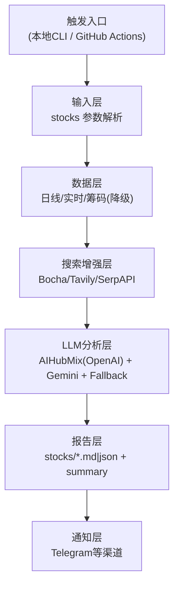

# 功能架构说明

本文档给出 JusticePlutus 的当前“单主路径”功能架构，便于开发、运维和交接时统一口径。

## 1. 总体架构



## 2. 模块划分

### 2.1 触发入口

- 本地：`python -m justice_plutus run`
- 远程：`.github/workflows/justice_plutus_analysis.yml`

### 2.2 输入层

- 覆盖顺序：`workflow_dispatch.stocks` > `--stocks` > `.env STOCK_LIST` > 环境变量 > 默认

### 2.3 数据层

- 日线：`Tushare -> Efinance -> Akshare -> Pytdx -> Baostock -> YFinance`
- 实时：`REALTIME_SOURCE_PRIORITY` 顺序，首源成功后继续补缺字段
- 筹码：`HSCloud -> Wencai -> Akshare -> Tushare -> Efinance`
- 熔断：实时与筹码都使用独立熔断器，避免故障源反复重试

### 2.4 搜索增强层

- Provider：`Bocha`、`Tavily`、`SerpAPI`
- 单维度失败不阻断主流程，保留已有上下文继续分析

### 2.5 LLM 分析层

- Key 优先级：`AIHUBMIX_KEY` -> `OPENAI_API_KEY`
- 主模型：`LITELLM_MODEL`（默认 `openai/gemini-flash-lite-latest`）
- 降级模型：`LITELLM_FALLBACK_MODELS`（默认 `openai/gpt-4o-mini`）

### 2.6 报告与通知层

- 单股：`reports/YYYY-MM-DD/stocks/<code>.md|json`
- 汇总：`summary.md`、`summary.json`、`run_meta.json`
- 推送：沿用现有模式，不增加新推送模式分支

## 3. 关键配置面

### 3.1 本地配置

- 文件：`.env`
- 模板：`.env.example`

### 3.2 远程配置（GitHub）

- `Repository Variables`：非敏感配置（如 `STOCK_LIST`、模型名、开关）
- `Repository Secrets`：敏感配置（如 API Keys、Cookie、Bot Token）

## 4. 触发与验收建议

### 4.1 本地触发

```bash
python -m justice_plutus run --stocks 000001,600519 --no-notify
```

验收：报告文件完整生成、日志无致命报错。

### 4.2 远程触发

```bash
gh workflow run justice_plutus_analysis.yml -f stocks='000001,600519'
gh run list --workflow justice_plutus_analysis.yml --limit 5
gh run watch <run-id> --exit-status
```

验收：Run 成功、artifact 上传成功、报告结构字段齐全。
